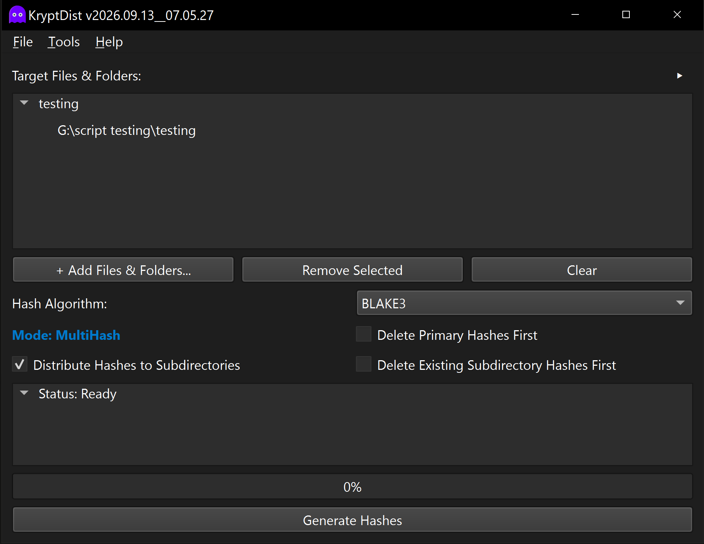

#  KryptDist™ 
**A high-performance checksum generator and integrity verification utility supporting primary and distributed subdirectory hash structures.**

---



## Overview
KryptDist™ is a high-performance checksum generation and integrity verification utility designed to produce and validate hierarchical checksum file sets across directories and nested subdirectories. It offers flexible multi-algorithm hashing, incremental updates for existing hash sets, and a streamlined On-Screen Display (OSD) verification workflow.

**Primary Environment:** Developed and tested on **Python 3.14.5** using the **PyQt6** framework. It is intended for archivists, system administrators, and data managers who require deterministic integrity verification, distributed subdirectory checksum sets, and fast multi-engine hashing.

### The Hashing & Verification Engine
The utility combines high-throughput hashing algorithms with intelligent directory traversal and validation routines.

Key operational features include:
1. **Multi-Folder Batch Processing:** Queue multiple root folders or files simultaneously via Drag & Drop or Windows **SendTo**. KryptDist processes every target folder independently in a unified batch run, generating root master hashes and distributed subfolder sets for each target in a single disk-read pass.
2. **Execution Control & Safe Locking:** While hash generation is in progress, the execution button transforms into a **Cancel** button with confirmation prompts. Target manipulation buttons, algorithm selections, and hashing options are safely locked until completion or cancellation.
3. **MultiHash & Distributed Subdirectory Hashes:** In MultiHash mode, generates both a root primary `.hash` file representing the full folder tree and individual `.hash` files within each nested subdirectory without re-reading or re-hashing files from disk.
4. **Multi-Engine Algorithm Suite:** Supports cutting-edge cryptographic hash functions (BLAKE3, BLAKE2b, BLAKE2s, SHA-512, SHA-256, SHA-3) alongside fast checksum and legacy algorithms (xx3 / xxHash3, SHA-1, MD5, SFV / CRC32).
5. **Smart Incremental Caching:** Automatically parses pre-existing primary and subdirectory hash files, skipping previously verified files and appending only newly detected files to conserve time and disk I/O.
6. **Collapsible Path Trees & Zero Horizontal Scroll:** Target lists and live hashing progress employ an expandable tree structure. Root items show clean file and folder names, while disclosure triangles (`▶` / `▼`) expand to reveal full, word-wrapped absolute paths without horizontal scrolling.
7. **Global Expand/Collapse Header Toggle:** A dedicated header toggle (`▶` / `▼`) on **Target Files & Folders** allows instantly expanding or collapsing all queued target paths at once.
8. **Configurable Exclusion & Ignore Engine:** Automatically filters out checksum files, temporary artifacts, OS metadata (e.g. `desktop.ini`, `thumbs.db`, `.DS_Store`), development caches (`__pycache__`, `.git`, `node_modules`), and system volumes. Full wildcard (`*`, `?`) matching is configurable via **Tools > Preferences > File Extensions to Ignore**.
9. **Notification Sound Suppression:** Includes an option under **Tools > Preferences > Options** to disable completion and alert chimes while preserving visual indicator badges.
10. **Pre-Generation Hash Cleaning:** Optional pre-execution controls allow automatically purging prior primary hash files, existing subdirectory hashes, or both before beginning a fresh hash pass.
11. **Themed Verification OSD:** Passing checksum files via the command line, drag-and-drop, or the Windows **SendTo** menu triggers an instant verification pass monitored by a compact, draggable On-Screen Display widget with application branding that dynamically adapts to Dark, Light, or System themes.
12. **Status Badges & Interactive Error Logging:** Verification completion dialogs display custom visual badges (green checkmark for intact data, red X for corruption/mismatch). If errors occur, users are prompted whether to generate and open an error log report in `KryptDist_internal/logs/`.
13. **Headless CLI & Single-File Verification:** Features direct command-line arguments (`-v` / `--verify-file`) with optional explicit manifest targeting (`--hash-file`) to verify individual files headlessly with zero GUI overhead, returning standard process exit codes (`0` for intact, `2` for mismatch/missing) for integration with managers such as HashMan. Container verification also supports `--headless` execution, auto-logging errors and exiting with code `0` or `1`.
14. **Persistent UI State & Theming:** Remembers window geometry, OSD screen coordinates, disclosure triangle expansion states, algorithm choices, processing options, ignore rules, and user-selected Dark, Light, or System-synced UI palettes.

---

## Feature Reference

| Option / Feature | Description |
| :--- | :--- |
| **Batch Multi-Folder Hashing** | Processes multiple root folders and files independently in a single queued execution. |
| **Execution Control** | Transformable Cancel button with confirmation and safe control locking during active hash passes. |
| **MultiHash Mode** | Generates a root primary `.hash` file and distributed subdirectory `.hash` files throughout the directory tree. |
| **Primary Hash Only Mode** | Generates only the root directory's primary `.hash` file without distributing hashes to subfolders. |
| **Incremental Smart Hashing** | Skips already-hashed relative paths recorded in existing checksum files and appends newly discovered files. |
| **Collapsible Path Trees** | Tree-based target list and progress display showing clean item names with word-wrapped full path disclosure (`▶` / `▼`). |
| **Header Expand/Collapse Toggle** | Instant batch expand/collapse control located on the **Target Files & Folders** section header. |
| **Preferences & Ignore Rules** | Configures comma-separated extensions, filenames, and directory exclusions with wildcard support. |
| **Sound Suppression Option** | Mutes completion and alert notification sounds while retaining visual indicators. |
| **Delete Primary Hashes First** | Automatically deletes existing root `.hash` files before scanning and calculating new digests. |
| **Delete Subdirectory Hashes First** | Traverses nested subfolders to remove existing checksum files while leaving primary hashes intact. |
| **Themed Verification OSD** | A lightweight, branded status overlay providing live feedback that dynamically matches Dark/Light themes. |
| **Status Badges & Error Logging** | Custom visual checkmark / error badges and prompt-based logging for verification mismatches. |
| **Headless CLI Verification** | Verifies single files via `-v` / `--verify-file` or containers via `--headless`, supporting explicit `--hash-file` targeting and standard exit codes. |
| **Theme Engine** | Full support for Dark, Light, and System-synced palettes via a customized `QPalette` implementation. |

---

## Command Line Usage

### Headless Single-File Verification
```text
python.exe KryptDist.py -v "path/to/target_file.mkv"
python.exe KryptDist.py --verify-file "target_file.mkv" --hash-file "custom_name.hash"
```
* **Exit Code `0`:** Checksum verified successfully.
* **Exit Code `2`:** Checksum mismatch, missing file, or invalid entry.

### Container Verification (OSD Mode)
```text
python.exe KryptDist.py "path/to/folder.hash"
```

### Headless Container Verification
```text
python.exe KryptDist.py --headless "path/to/folder.hash"
```
* **Exit Code `0`:** All files verified and intact.
* **Exit Code `1`:** Verification failures or missing files detected (error report automatically written to `KryptDist_internal/logs/`).

### Launch GUI with Preloaded Targets
```text
python.exe KryptDist.py "path/to/folder1" "path/to/folder2" "path/to/file.ext"
```

---

## Assets & Licensing
This software is released under the **GNU General Public License v3**.

### Icon Credits
* **File:** `KryptDist_ghost_icon.svg`
    * **Asset:** Ghost SVG Vector
    * **Source:** <a href="https://www.svgrepo.com/svg/54269/ghost" target="_blank">https://www.svgrepo.com/svg/54269/ghost</a>
    * **License:** <a href="https://creativecommons.org/publicdomain/zero/1.0/" target="_blank">CC0 License</a>
    * **Modifications:** Modified by pwshAgyjkcrg761.

---

## Dependencies
* **OS:** Microsoft Windows 10 / 11 (Cross-platform compatible).
* **Python:** 3.14.5+ (Recommended).
* **PyQt6:** Required for Graphical User Interface and OSD components.
* **Optional Packages:**
  * `blake3` (for hardware-accelerated BLAKE3 hashing)
  * `xxhash` (for fast xx3 / xxh3_64 hashing)

## Support & Maintenance
**This repository is provided "as-is" for archival purposes.** The author is not actively looking for feedback, feature requests, or bug reports. The issue tracker is disabled.

## Disclaimer
*KryptDist™ is an integrity hashing and verification utility. The author is not responsible for data loss resulting from hardware failure, storage degradation, or improper file handling. Always maintain verified secondary and off-site backup copies.*

---
> **Document Control**<br>
> *This document is up-to-date with the following version of KryptDist™.*<br>
> *2026.09.12__00.23.48*