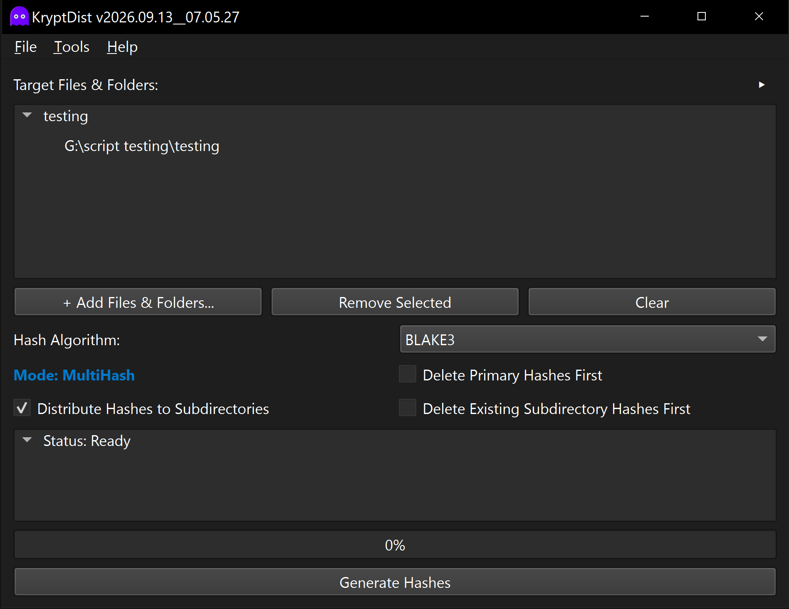

#  KryptDist™ 
**A high-performance checksum generator and integrity verification utility supporting primary and distributed subdirectory hash structures.**

---



## Overview
KryptDist™ is a high-performance checksum generation and integrity verification utility designed to produce and validate hierarchical checksum file sets across directories and nested subdirectories. It offers flexible multi-algorithm hashing, incremental updates for existing hash sets, Win32 Overlapped hardware watchdog protection, optical media fast-abort safeguards, and a streamlined On-Screen Display (OSD) verification workflow.

**Primary Environment:** Developed and tested on **Python 3.14.5** using the **PyQt6** framework. It is intended for archivists, system administrators, and data managers who require deterministic integrity verification, distributed subdirectory checksum sets, and fast multi-engine hashing.

### The Hashing & Verification Engine
The utility combines high-throughput hashing algorithms with intelligent directory traversal, hardware error isolation, and validation routines.

Key operational features include:
1. **Multi-Folder & Standalone Batch Processing:** Queue multiple root folders and individual files simultaneously via Drag & Drop, Windows **SendTo**, or the explorer picker. KryptDist processes every target independently in a single disk-read pass—generating root master hashes and distributed subfolder sets for directories, and dedicated `<filename>.hash` manifests for individual files.
2. **Dual-Pane File & Folder Picker:** The **+ Add Files & Folders...** dialog provides a dual-pane explorer with a drive/folder navigation tree on the left and a contents view on the right, supporting simultaneous multi-selection of both files and directories.
3. **Execution Control & Safe Locking:** While hash generation is in progress, the execution button transforms into a **Cancel** button with confirmation prompts. Target manipulation buttons, algorithm selections, and hashing options are safely locked until completion or cancellation.
4. **MultiHash & Distributed Subdirectory Hashes:** In MultiHash mode, generates both a root primary `.hash` file representing the full folder tree and individual `.hash` files within each nested subdirectory without re-reading or re-hashing files from disk.
5. **Multi-Engine Algorithm Suite:** Supports cutting-edge cryptographic hash functions (BLAKE3, BLAKE2b, BLAKE2s, SHA-512, SHA-256, SHA-3) alongside fast checksum and legacy algorithms (xx3 / xxHash3, SHA-1, MD5, SFV / CRC32).
6. **Smart Incremental Caching:** Automatically parses pre-existing primary and subdirectory hash files, skipping previously verified files and appending only newly detected files to conserve time and disk I/O.
7. **Win32 Overlapped Hardware Watchdog:** Utilizes asynchronous Win32 Overlapped I/O with a strict 20-second timeout on all storage media. Stalled reads or damaged sectors are cleanly aborted using kernel `CancelIoEx` without freezing the console or GUI.
8. **Optical Media Protection & Fast-Abort:** Automatically detects CD, DVD, and BD-R/RE media (`DRIVE_CDROM`). On the very first read error, CRC failure (`Error 23`), or timeout, KryptDist immediately cancels all remaining files on the disc, shuts down the optical laser/spindle, and presents the error report, eliminating drive wear.
9. **Non-Optical Fault Resilience:** For mechanical HDDs, SSDs, and USB drives, read errors are isolated per file, allowing the remainder of the disk to be audited without halting the queue.
10. **Smoothed Rolling-Window ETA Engine:** Headless stream monitoring (`VERIFY_PROGRESS`) calculates real-time throughput and ETA using a smoothed 5-second rolling window and a 2-second spin-up buffer, providing stable estimates across CAV optical tracks.
11. **Natural Voice Notifications:** Features Kokoro TTS voice personas (**Emma [GB]** and **Heart [USA]**) under **Tools > Preferences > Notifications**, complete with an inline audio preview button (`▶`) and granular event toggles for *Hash Generation Completed*, *Hash Verification Completed*, and *Hash Verification Failed*. Master mute toggle grays out controls while retaining visual badges (audio is automatically suppressed in headless mode).
12. **Configurable Exclusion & Drag-and-Drop Feedback:** Automatically filters out checksum manifests, temporary artifacts, companion image thumbnails (`*-thumb.jpg`, `*-thumb.png`), OS metadata (`desktop.ini`, `thumbs.db`, `.DS_Store`), and development caches. Dragging exclusively ignored items displays a forbidden `🚫` cursor and rejects the drop; launching exclusively ignored items via SendTo/CLI cleanly exits without opening the GUI.
13. **Collapsible Path Trees & Zero Horizontal Scroll:** Target lists and live hashing progress employ an expandable tree structure. Root items show clean file and folder names, while disclosure triangles (`▶` / `▼`) expand to reveal full, word-wrapped absolute paths without horizontal scrolling.
14. **Global Expand/Collapse Header Toggle:** A dedicated header toggle (`▶` / `▼`) on **Target Files & Folders** allows instantly expanding or collapsing all queued target paths at once.
15. **Pre-Generation Hash Cleaning:** Optional pre-execution controls allow automatically purging prior primary hash files, individual file manifests, existing subdirectory hashes, or all of the above before beginning a fresh hash pass.
16. **Themed Verification OSD:** Passing checksum files via the command line, drag-and-drop, or the Windows **SendTo** menu triggers an instant verification pass monitored by a compact, draggable On-Screen Display widget with application branding that dynamically adapts to Dark, Light, or System themes.
17. **Status Badges & Interactive Error Logging:** Verification completion dialogs display custom visual badges (green checkmark for intact data, red X for corruption/mismatch). If errors occur, users are prompted whether to generate and open an error log report in `KryptDist_internal/logs/`.
18. **Headless CLI & Single-File Verification:** Features direct command-line arguments (`-v` / `--verify-file`) with optional explicit manifest targeting (`--hash-file`) to verify individual files headlessly with zero GUI overhead, returning standard process exit codes (`0` for intact, `2` for mismatch/missing). Container verification also supports `--headless` execution, auto-logging errors and exiting with code `0` or `1`.
19. **Clean Interruption & Process Teardown:** Pressing `Ctrl+C` cancels all active Win32 handles instantly, closes the OSD, and exits cleanly without false error reports or orphan processes.
20. **Persistent UI State & Theming:** Remembers window geometry, OSD screen coordinates, disclosure triangle expansion states, algorithm choices, processing options, ignore rules, notification preferences, and user-selected Dark, Light, or System-synced UI palettes.

---

## Feature Reference

| Option / Feature | Description |
| :--- | :--- |
| **Batch & Standalone Hashing** | Processes multiple root folders and standalone files independently in a single queued execution, outputting `<filename>.hash` for individual files. |
| **Dual-Pane Explorer Picker** | Dual-pane navigation dialog supporting drive traversal and simultaneous multi-selection of both files and folders. |
| **Execution Control** | Transformable Cancel button with confirmation and safe control locking during active hash passes. |
| **MultiHash Mode** | Generates a root primary `.hash` file and distributed subdirectory `.hash` files throughout the directory tree. |
| **Primary Hash Only Mode** | Generates only the root directory's primary `.hash` file without distributing hashes to subfolders. |
| **Incremental Smart Hashing** | Skips already-hashed relative paths recorded in existing checksum files and appends newly discovered files. |
| **Hardware I/O Watchdog** | Enforces a strict 20-second Win32 Overlapped timeout to abort stalled drives and bad sectors via kernel `CancelIoEx`. |
| **Optical Media Protection** | Auto-detects `DRIVE_CDROM` and executes an instant fast-abort on the first read error/timeout, stopping laser wear. |
| **Smoothed ETA Engine** | Computes ETA via a 5-second rolling throughput window with a 2-second warm-up buffer for CAV optical drives. |
| **Voice Notifications** | Kokoro TTS audio personas (Emma [GB] & Heart [USA]) with inline preview (`▶`) and granular event toggles. |
| **Ignore Rules & Drag Feedback** | Exclusion engine supporting wildcards, CLI/SendTo auto-filtering, and forbidden `🚫` drag cursors. |
| **Collapsible Path Trees** | Tree-based target list and progress display showing clean item names with word-wrapped full path disclosure (`▶` / `▼`). |
| **Header Expand/Collapse Toggle** | Instant batch expand/collapse control located on the **Target Files & Folders** section header. |
| **Delete Primary Hashes First** | Automatically deletes existing root `.hash` files or individual file `.hash` manifests before scanning and calculating new digests. |
| **Delete Subdirectory Hashes First** | Traverses nested subfolders to remove existing checksum files while leaving primary hashes intact. |
| **Themed Verification OSD** | A lightweight, branded status overlay providing live feedback that dynamically matches Dark/Light themes. |
| **Status Badges & Error Logging** | Custom visual checkmark / error badges and prompt-based logging for verification mismatches. |
| **Headless CLI Verification** | Verifies single files via `-v` / `--verify-file` or containers via `--headless`, supporting explicit `--hash-file` targeting and standard exit codes. |
| **Theme Engine** | Full support for Dark, Light, and System-synced palettes via a customized `QPalette` implementation. |

---

## Command Line Usage

### Headless Single-File Verification
```text
python.exe KryptDist.py -v "path/to/target_file.mkv"
python.exe KryptDist.py --verify-file "target_file.mkv" --hash-file "custom_name.hash"
```
* **Exit Code `0`:** Checksum verified successfully.
* **Exit Code `2`:** Checksum mismatch, missing file, or invalid entry.

### Container Verification (OSD Mode)
```text
python.exe KryptDist.py "path/to/folder.hash"
```

### Headless Container Verification
```text
python.exe KryptDist.py --headless "path/to/folder.hash"
```
* **Exit Code `0`:** All files verified and intact.
* **Exit Code `1`:** Verification failures or missing files detected (error report automatically written to `KryptDist_internal/logs/`).

### Launch GUI with Preloaded Targets
```text
python.exe KryptDist.py "path/to/folder1" "path/to/folder2" "path/to/file.ext"
```

---

## Assets & Licensing
This software is released under the **GNU General Public License v3**.

### Icon Credits
* **File:** `KryptDist_ghost_icon.svg`
    * **Asset:** Ghost SVG Vector
    * **Source:** <a href="https://www.svgrepo.com/svg/54269/ghost" target="_blank">https://www.svgrepo.com/svg/54269/ghost</a>
    * **License:** <a href="https://creativecommons.org/publicdomain/zero/1.0/" target="_blank">CC0 License</a>
    * **Modifications:** Modified by pwshAgyjkcrg761.

### Audio Notification Credits
* **Audio Notifications:** Generated with <a href="https://huggingface.co/spaces/hexgrad/Kokoro-TTS" target="_blank">Kokoro TTS</a>.
    * **License:** <a href="https://creativecommons.org/publicdomain/zero/1.0/" target="_blank">CC0 License</a>

---

## Dependencies
* **OS:** Microsoft Windows 10 / 11 (Cross-platform compatible).
* **Python:** 3.14.5+ (Recommended).
* **PyQt6:** Required for Graphical User Interface and OSD components.
* **Optional Packages:**
  * `blake3` (for hardware-accelerated BLAKE3 hashing)
  * `xxhash` (for fast xx3 / xxh3_64 hashing)

## Support & Maintenance
**This repository is provided "as-is" for archival purposes.** The author is not actively looking for feedback, feature requests, or bug reports. The issue tracker is disabled.

## Disclaimer
*KryptDist™ is an integrity hashing and verification utility. The author is not responsible for data loss resulting from hardware failure, storage degradation, or improper file handling. Always maintain verified secondary and off-site backup copies.*

---
> **Document Control**<br>
> *This document is up-to-date with the following version of KryptDist™.*<br>
> *2026.09.30__13.36.12*